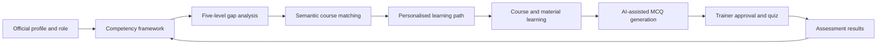
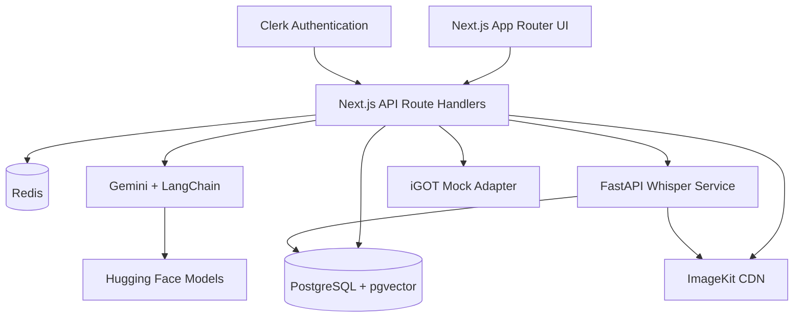

# STATSAARTHI

### Role-aware learning intelligence for India's Official Statistical System

STATSAARTHI is an AI-enabled learning platform that helps government officials understand **which skills their role requires, where their competency gaps are, and what learning action should come next**.

It connects competency mapping, personalised course recommendations, and AI-assisted assessment in one measurable learning loop.

> SIH 2026 | Problem Statement: SIH26101

[](https://github.com/subhamayraj/SIH-2026)
[](https://nextjs.org/)
[](https://www.typescriptlang.org/)
[](https://ai.google.dev/)
[](https://www.langchain.com/)

---

## The Problem

India's Official Statistical System is adopting AI, big data, GIS, and cloud computing. Officials therefore need continuous upskilling, but a large course catalogue alone does not answer the questions that matter:

- Which competencies are required for a particular role?
- How large is an individual's skill gap?
- Which course should they take first, and why?
- Did the training improve demonstrated competency?

The iGOT Karmayogi platform offers thousands of courses, yet course completion does not necessarily prove skill gain. STATSAARTHI addresses this visibility and measurement gap by connecting role requirements, learning recommendations, and assessment evidence.

## Our Solution

STATSAARTHI builds a competency profile for every official and compares it with role-specific requirements on a five-level proficiency scale. It then:

1. Identifies and ranks competency gaps.
2. Recommends relevant iGOT Karmayogi and NSSTA learning resources.
3. Creates a sequenced learning path with a clear reason for every recommendation.
4. Converts approved PDF, PPTX, DOCX, and video material into validated MCQs.
5. Feeds assessment results back into the competency profile.

The result is a closed loop: **profile -> gap -> recommendation -> learning -> assessment -> updated profile**.

## How It Works



## Core Modules

| Module | What it does | Value |
| --- | --- | --- |
| Competency Profile | Maps an official's current proficiency to role requirements | Makes skill gaps visible |
| Gap Analysis | Scores and ranks missing or underdeveloped competencies | Creates a focused priority list |
| Course Recommendations | Uses embeddings, rules, and role context to match courses | Recommends the next best learning action |
| Learning Path | Sequences courses from foundational to advanced | Turns a catalogue into a plan |
| Intelligent Assessment Engine | Extracts learning content and generates explainable MCQs | Measures knowledge, not just attendance |
| Admin Analytics | Shows department-level readiness, gaps, and completion trends | Supports workforce planning |

## Methodology

### 1. Competency modelling

Competencies are organised into domains such as Core Statistics, Data Management, IT and Digital Skills, Domain Knowledge, and Soft Skills. Each competency has a required proficiency level from 1 to 5.

### 2. Gap scoring

For a competency $s$, the basic gap is calculated as:

$$
Gap(s) = max(RequiredLevel(s) - CurrentLevel(s), 0)
$$

Gaps are prioritised using role relevance, department priorities, and the distance between current and required proficiency.

### 3. Hybrid recommendation

The recommendation engine combines semantic similarity with explainable business rules:

$$
MatchScore = Similarity(profile, course) + DomainBoost + DifficultyBoost + PriorityBoost
$$

The top recommendations receive short AI-generated explanations so that officials can understand why a course is relevant.

### 4. Assessment and feedback

Uploaded material is extracted or transcribed, passed through a structured question-generation prompt, validated, and sent for trainer approval. Quiz scores and demonstrated competency are then used to update the learner's profile.

## System Architecture



## Technology Stack

| Layer | Technology | Responsibility |
| --- | --- | --- |
| Web application | Next.js 14, App Router, TypeScript | Frontend, server rendering, and API route handlers |
| UI | React, Tailwind CSS, Recharts | Dashboards, charts, responsive interaction |
| Authentication | Clerk | Sessions, protected routes, and role-aware access |
| Database | PostgreSQL 16, Prisma ORM | Users, competencies, courses, progress, quizzes, and results |
| Vector search | pgvector | Semantic matching between competency profiles and courses |
| AI | Google Gemini 2.0 Flash | Quiz generation, explanations, and recommendation reasoning |
| Embeddings | Gemini `text-embedding-004` | Profile and course similarity search |
| AI orchestration | LangChain.js | Prompt chains, structured outputs, validation, and model routing |
| Open-source AI | Hugging Face Transformers / Inference API | Optional specialist NLP models and model experimentation |
| Media | ImageKit | Direct upload, storage, CDN delivery, and video assets |
| Transcription | Python, FastAPI, faster-whisper | Video/audio transcription microservice |
| Caching | Redis 7 | Embedding and frequently requested data cache |
| Local infrastructure | Docker Compose | PostgreSQL, pgvector, Redis, and service orchestration |

## Repository Structure

```text
SIH-2026/
├── web/                         # Next.js application and Prisma schema
│   ├── src/app/                 # Pages, dashboards, and API routes
│   ├── src/components/          # Reusable UI components
│   ├── src/server/              # Competency and recommendation services
│   ├── src/lib/                 # AI, database, media, and API utilities
│   └── prisma/                  # Schema and migrations
├── transcription-service/       # FastAPI + faster-whisper service
├── docker-compose.yml           # Local infrastructure
├── project_description.md       # Detailed project brief
└── README.md                    # Project overview and implementation guide
```

## Key User Journeys

### Employee

`Sign in -> View competency profile -> Inspect skill gaps -> Accept recommendation -> Learn -> Take quiz -> Track progress`

### Administrator

`Sign in -> View organisation readiness -> Inspect department heatmap -> Identify priority skills -> Monitor learning outcomes`

### Trainer

`Upload material -> Review generated questions -> Approve quiz -> Publish assessment -> Inspect learner performance`

## Security and Responsible AI

- Clerk handles identity and session verification; roles are assigned server-side.
- Client-supplied roles are never trusted for authorisation.
- Uploaded material is stored through signed media upload flows.
- The transcription service is internal and protected by a shared service secret.
- Trainers approve generated questions before they become assessments.
- Personal data handling is designed with the principles of the Digital Personal Data Protection Act, 2023 in mind.
- AI output is treated as assistive content and validated before use.

## Implementation Roadmap

| Phase | Deliverable |
| --- | --- |
| 1 | Monorepo, Docker, Prisma schema, authentication, and seed data |
| 2 | Material upload, extraction/transcription, quiz generation, and quiz UI |
| 3 | Competency framework, profile, and gap analysis |
| 4 | Embeddings, pgvector search, and personalised recommendations |
| 5 | Employee dashboard, progress tracking, and visual analytics |
| 6 | Admin heatmap, workforce readiness, and organisation reporting |
| 7 | Responsive polish, accessibility, testing, and demo preparation |

## Demo Story

The intended demo follows one clear narrative:

1. An official signs in and views their role-based competency profile.
2. STATSAARTHI highlights the largest competency gaps.
3. The platform recommends a course and explains the match.
4. A trainer uploads a short learning document or video.
5. The system generates questions for approval.
6. The official takes the quiz and sees explanations and score.
7. The profile updates so progress is measurable.

## Project Status

This repository contains the STATSAARTHI implementation plan and project documentation for SIH 2026. The iGOT Karmayogi integration is represented by a realistic mock adapter for the hackathon environment; production deployment would replace it with an approved integration.

## Team and Contribution

Contributions are welcome as the implementation progresses. Please open an issue before a large change so architecture, data privacy, and API contracts remain consistent.

## License

License information will be added with the first implementation release.
